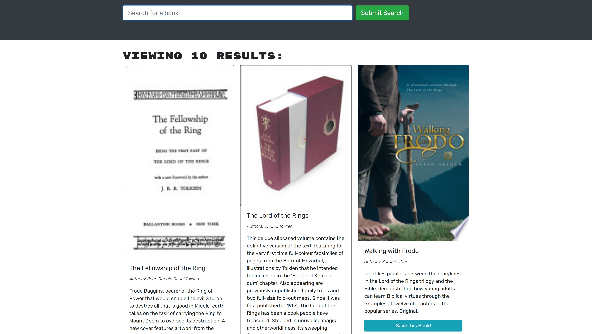

# MERN-Book-Search-Engine

## Description

This project involved refactoring code for a Google Books search engine to change from a REST API to a GraphQL API. This involves setting up an Apollo Server, then deploying the finished project to MongoDB Atlas and Heroku. The end result has the same functionality of being able to search the Google Books database, create/login/logout a user, and save books to a user account. However, the code will be trimmer.

## Installation

This program may be forked from [Github](https://github.com/rensyphon/MERN-Book-Search-Engine), then installed by running `npm i` and `npm run develop` in a source code editor terminal.

## Usage

Navigate to [Heroku deployment](https://dry-citadel-52924.herokuapp.com/). Create an account through the "Login/Sign Up" link in the top right, then "Sign Up." An email address, username, and password will be required. After this, you may click the "Logout" link to logout. Search books by entering a search term into the box and clicking "Submit Search." While logged in, you can click "Save this Book!" to save a book to your account, then click the "See Your Books" link in the top right to view your saved books.

    ```md
    
    ```

## Credits

Original code and icons created by University of Arizona Full Stack Coding Boot Camp, 2022. https://bootcamp.ce.arizona.edu/coding/